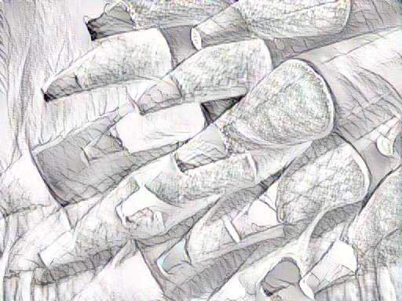
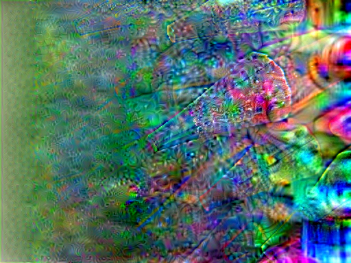

# STROTSS-keras
Keras Implementation of Reproducing "Style Transfer by Relaxed Optimal Transport and Self-Similarity" (CVPR 2019)

## Introduction
This repository aims to reproduce the paper, and re-implement the codes in Keras. 

The area of reproducing contains implementation, performance reproducing, and assessment in the paper. 
This repository currently reproduced only implementation, 
so you may only refer to code style or structures. 

This repository is one of the projects in [RP12 Study](https://github.com/rp12-study/rp12-hub), 
study of "Reproducing Papers" for contributing open sources.  

## Milestones
3 of 5 milestones are finished. 

https://github.com/nuxlear/STROTSS-keras/milestones

Every milestone remain as branches, 
and there may be more branches for ongoing milestones. 

## Dependencies
- Python >= 3.5
- Keras
- tensorflow
- imageio
- opencv-python

## Implementations
- [x] Feature Extraction
- [x] Loss & Optimizer
- [x] Training loop
- [ ] User Control
- [ ] Assessment
- [ ] Web Demo

## Usage
```buildoutcfg
python style_transfer.py [CONTENT_IMAGE_PATH] [STYLE_IMAGE_PATH] [CONTENT_WEIGHT]
```

The result image will be store at `results/output.png`

## Result

- Original implementation (STROTSS)



- Keras implementation (STROTSS-keras)



It seems that some problems are in regional sampling or calculating losses. 


## References
1. STROTSS (https://github.com/nkolkin13/STROTSS)
