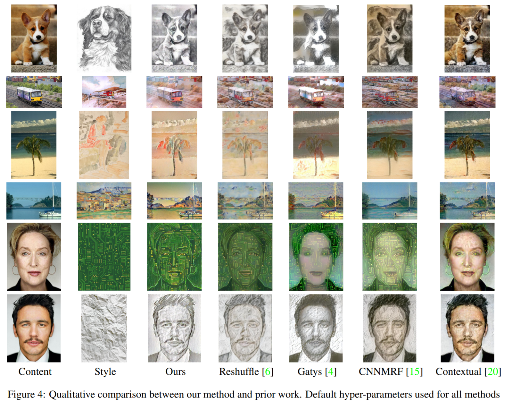
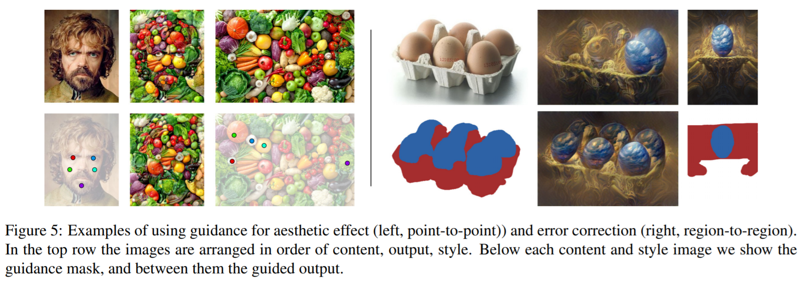
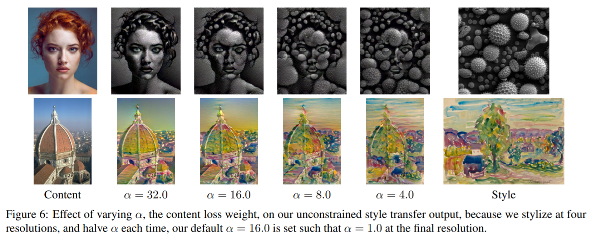
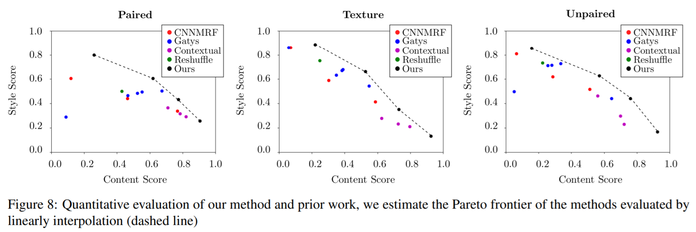
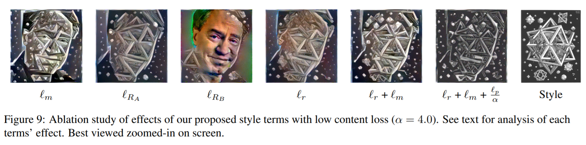

# Style Transfer by Relaxed Optimal Transport and Self-Similarity

#### Nicholas Kolkin, Jason Salavon, Greg Shakhnarovich, CVPR 2019  [[arXiv]](https://arxiv.org/abs/1904.12785) [[PDF]](https://arxiv.org/pdf/1904.12785.pdf) [[GitHub]](https://github.com/nkolkin13/STROTSS)

## Keywords
- Style Transfer
- Self-similarity
- Relaxed Earth-Mover Distance (REMD)
- User-specified control 

## Contribution
- 기존 style transfer 기술들에 비해 같은 수준의 content 보존에서 더 나은 stylization이 가능하다.
- content 보존을 조절하는 파라미터와 point-to-point, region-to-region 매핑을 통해 stylization을 사용자가 customization을 할 수 있다. 
- Amazon Mechanical Turk (AMT)를 활용해 많은 인원의 정성적인 평가를 점수화 했고, 이를 통해 성능 비교가 어려운 style transfer 모델들을 보다 객관적으로 비교할 수 있도록 했다. 

## Proposed Method

### Summary

전체적인 process는 다음과 같다. 
- output 이미지를 content 이미지의 laplacian pyramid 맨 아래 층에 style 이미지의 평균값을 더하는 걸로 초기화한다. 
- 아래의 방법으로 loss를 구하고 가중치들을 업데이트한다. 
  - VGG16의 여러 레이어들의 결과를 모아 hypercolumn으로 만든다. 
  - style 이미지와 output 이미지의 추출된 feature vector 간의 Relaxed Earth-Mover Distance (REMD)를 구한다. 
  - content 이미지와 output 이미지의 추출된 feature vector 간의 cosine distance를 구한다. 
  - point-to-point, region-to-region control을 반영해 loss를 계산한다. 
- $\alpha$를 16.0에서 1.0으로 절반씩 줄여가며 5번 반복한다. 
- RMSprop의 lr을 마지막을 0.002로 하고 나머지를 0.001로 해 200번씩 업데이트 한다. 
- 매 단계 마다 1024개의 좌표를 sampling해 loss를 계산한다. 

### Losses

논문에서는 style loss와 content loss를 포함한 전체 loss function을 다음과 같이 정의했다. 
- style 이미지 $I_S$, content 이미지 $I_C$, 출력 이미지 $X$
- $\alpha$는 style 적용에 대한 content 보존의 상대적 비율을 의미한다.

$$
L(X, I_C, I_S = {{ 
{{ \alpha \ell_C + \ell_m + \ell_r + {{1 \over \alpha}} \ell_p }} 
\over 
{{ 2 + \alpha + {{1 \over \alpha}} }} }})
$$ 

Relaxed EMD의 수식은 다음과 같다. 
- 각 벡터 간 partial pairwise assignment matrix $T$, $A$로부터 $B$로의 cost matrix $C$

$$
\ell_r = REMD(A, B) = \max(R_A(A, B), R_B(A, B)) \\
\ell_r = \max \left( {{1 \over n}} \sum_{i}\min_{j}C_{ij}, 
                    {{1 \over m}} \sum_{j}\min_{i}C_{ij} \right)
$$

Self-similarity를 계산하는 수식은 다음과 같다. 
- $X$의 hypercolumn 간 cosine distance matrix $D^X$
$$
\mathcal{L}_{content}(X, I_C) = {{1 \over n^2}} \sum_{i, j} 
\left\vert {{ D_{ij}^X \over \sum_i D_{ij}^X }} - 
            {{ D_{ij}^{{I_C}} \over \sum_i D_{ij}^{{I_C}} }} \right\vert
$$

### User Control

Relaxed EMD의 기본 수식 형태를 다음과 같이 바꾼다. 
- output 이미지와 style 이미지의 구역 쌍의 집합 $(X_{t1}, S_{s1})...(X_{tK}, S_{sK})$
$$
Cij = 
\begin{cases}
\beta * D_{cos}(A_i, B_j), \text{if } i \in X_{tk}, j \in S_{sk} \\
\infty, \text{if } \exist k \ \text{ s.t. } i \in X_{tk}, j \notin S_{sk} \\
D_{cos}(A_i, B_j) \ \text{ otherwise,}
\end{cases}
$$

## Results

- 여러 이미지 간 style transfer 결과

 

- 다른 style transfer 간의 결과 비교

 

- user control 유무의 결과 비교

 

- $\alpha$ 값의 변화에 따른 결과 비교

 

- Amazon Mechanical Turk (AMT)를 통한 정성적 평가의 비교

 

- 각 요소 별 ablation test

## Related Works
- Image Analogy
- Neural Image Style Transfer
- Deep Feature Reshuffle
- Markov Random Fields & CNN
- Contextual Loss for Image Transformation
- Inpainting